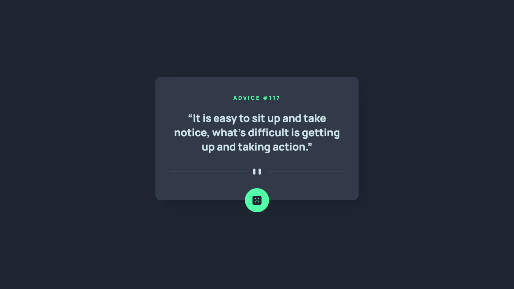

# Frontend Mentor - Advice generator app solution

This is a solution to the [Advice generator app challenge on Frontend Mentor](https://www.frontendmentor.io/challenges/advice-generator-app-QdUG-13db). Frontend Mentor challenges help you improve your coding skills by building realistic projects.

## Table of contents

- [Overview](#overview)
  - [The challenge](#the-challenge)
  - [Screenshot](#screenshot)
  - [Links](#links)
- [My process](#my-process)
  - [Built with](#built-with)
  - [What I learned](#what-i-learned)
  - [Useful resources](#useful-resources)
- [Author](#author)

## Overview

### The challenge

Users should be able to:

- [x] View the optimal layout for the app depending on their device's screen size
- [x] See hover states for all interactive elements on the page
- [x] Generate a new piece of advice by clicking the dice icon

### Screenshot



### Links

- Solution URL: [Add solution URL here](https://your-solution-url.com)
- Live Site URL: [Add live site URL here](https://your-live-site-url.com)

## My process

### Built with

- Semantic HTML5 markup
- CSS custom properties
- CSS Grid
- CSS Animations
- [Sass](https://sass-lang.com/)
- [Fetch API](https://developer.mozilla.org/en-US/docs/Web/API/Fetch_API)

### What I learned

With this project I had the opportunity to review again CSS Grid, CSS animations and add hover styles on specific devices.

```css
element {
  animation: anim /* animation settings */;
}

@keyframes anim {
  to {
    /* props to animate */
  }
}

@media (hover: hover) {
  /* hover styles*/
}
```

### Useful resources

- [Advice Slip JSON API](https://api.adviceslip.com/)
- [Using CSS animations](https://developer.mozilla.org/en-US/docs/Web/CSS/CSS_Animations/Using_CSS_animations)
- [Using the Fetch API](https://developer.mozilla.org/en-US/docs/Web/API/Fetch_API/Using_Fetch)
- [My Custom CSS Reset by Josh Comeau](https://www.joshwcomeau.com/css/custom-css-reset/)
- [hover](https://developer.mozilla.org/en-US/docs/Web/CSS/@media/hover)

## Author

- Frontend Mentor - [@raubaca](https://www.frontendmentor.io/profile/raubaca)
- Twitter - [@raubaca](https://www.twitter.com/raubaca)
- LinkedIn - [Raúl Barrera Castiblanco](https://www.linkedin.com/in/raubaca/)
- Codepen - [Raúl Barrera](https://codepen.io/raubaca)
